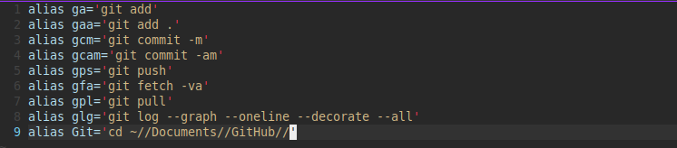

# Introduction

Here you will find information relating to the `.bashrc` file that will enable you to use aliases in the terminal. 

First of all quick summarise explanation of the **shell** like "**Git Bash**" application. 

--------------------

## Shell:

A shell is a command-line interface (CLI) that allows users to interact with an operating system by typing commands. It is the user's gateway to the core functionality of the computer. The shell interprets the commands you type and communicates with the operating system to execute them. It provides a text-based way to control and manage the system, run programs, and perform various tasks.

### Shell Diagram

<div align="center">

```
  User
   |
   v
   Shell
   |
   v
   Operating System
```

</div>


## What is **`.bashrc` File**?

The .bashrc file is a script used by the Bash shell (the default shell on most Unix-like systems, including Linux) to configure its behavior and environment for each user. It is located in the user's home directory and is executed every time a new shell session is started. This file can contain custom configurations, environment variables, **aliases**, and functions to personalize and enhance your command-line experience.

### `.bashrc` file Diagram

<div align="center">

```
User's Home Directory
|
v
.bashrc
```

</div>

**Sourcing `.bashrc`:**

When you "source" the .bashrc file, you are telling the current shell session to read and execute the commands and configurations specified in that file. This is typically done by running the `source ~/.bashrc` or `.` (dot) `~/.bashrc` command. Sourcing the `.bashrc` file is essential because it ensures that your customized settings and environment variables are applied in your current shell session.

<div align="center">

```
  User                  User
  |                     |
  v                     v
  Shell                Shell
  |                     |
  v                     v
 .bashrc               .bashrc
  |                     |
  v                     v
   Execute               Execute
  |                     |
  v                     v
 Customized            Customized
  Shell                 Shell
 Environment          Environment
```

</div>

### **Here's a step-by-step explanation:**

1. You start a new shell session.
2. The shell loads its default configuration.
3. To apply your custom settings from the `.bashrc` file, you need to source it.
4. Sourcing reads the file, executes the commands within, and updates the environment for your current session.
5. Now, your shell session is personalized with your custom configurations and environment variables.
6. Without sourcing the `.bashrc`, your custom settings won't take effect, and you'll be using the default shell environment.

In summary, a shell is your command-line interface, the `.bashrc` file is where you customize your shell environment, and you need to source it to apply these customizations to your current shell session.

-----------------------

## Editing your `.bashrc`

From your current location which should be `~` or `g//` in:

~~~admonish terminal

```
$ vim ~/.bashrc
```

~~~

This should load an empty file with the text editor **vim** called `.bashrc` in the home directory denoted by the `~`. The `.` means it is a hidden file.

Inside the file file remember to presse `i` on keyboard to enter **INSERT** mode, and reproduce the following: 

~~~admonish code

```sh
alias ga='git add'
alias gaa='git add .'
alias gcm='git commit -m'
alias gcam='git commit -am'
alias gps='git push'
alias gfa='git fetch -va'
alias gpl='git pull'
alias glg='git log --graph --oneline --decorate --all'
alias Git='cd ~//Documents//GitHub//'
```

~~~

Would look similar to below:



Remember to write and quit using first the escape key to exit **INSERT** mode to enter **COMMAND** mode and press the `:` and type `wq` to write and quit.

Now that you have your .bashrc file you need to get the current instant of the shell to recongnise it. 

~~~admonish terminal

```sh
$ source ~/.bashrc
```

~~~

You should now be able to use any of the aliases instead of typing out the full commands.