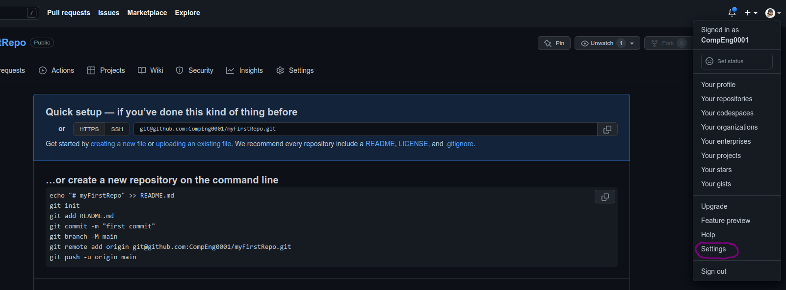
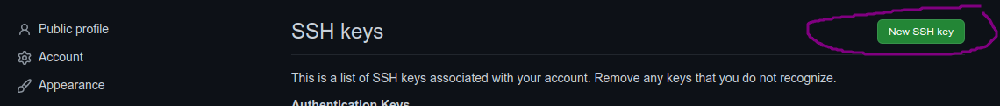
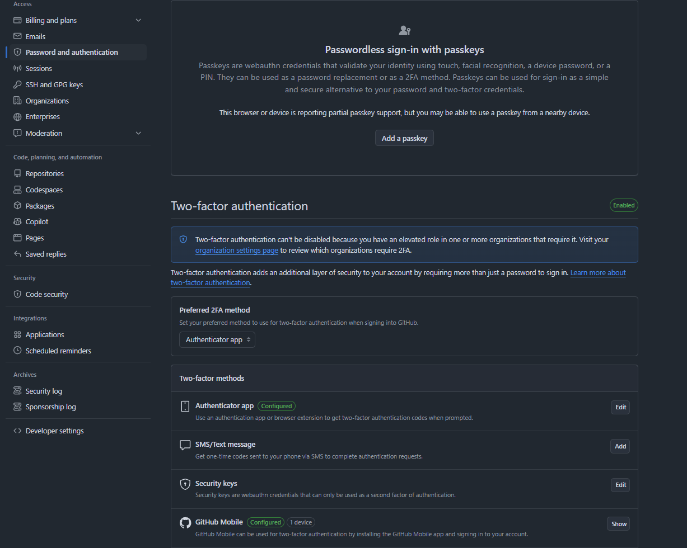

# Documentation

~~~admonish note
- Version: 1.0.0
- View the deployment for a rendered documentation:
  - [https://uniofgreenwich.github.io/MD_Book_Template](https://uniofgreenwich.github.io/MD_Book_Template)
~~~

This template can used to create a place for all exercises or source of knowledge for your module, which is deployed as a webpage with the following address:

`https://uniofgreenwich.github.io/Name_of_your_Repository`, best practice is to prefix with the module code.

Examples: 
    
- [https://uniofgreenwich.github.io/ELEE1147_Exercises/](https://uniofgreenwich.github.io/ELEE1147_Exercises/)

- [https://uniofgreenwich.github.io/ELEE1119_Exercises/](https://uniofgreenwich.github.io/ELEE1119_Exercises/)

## How to...

### Setting up Git/Github

Open Git Bash 

First set your username:

~~~admonish terminal

```sh
git config --global user.name "YourGitHubUserName"
```
~~~

Next set your email:

~~~admonish terminal

```sh
git config --global user.email "TheEmailYouUsedForGitHub"
```

~~~

## Security and authentication

You need to create an ssh key to push and pull to your online storage/repo before we try to sync with the cloud. 

~~~admonish important

- When you see `~`, this means **home**, 

  - On the university imaged machines this typically is the `G Drive`

  - If you are not then this will be, `C/Users/<username>/`, your **home**

~~~

Follow these instructions in the command line.

~~~admonish terminal

```sh
myfirstrepository on  dev
❯ ssh-keygen -t ed25519 -C "YourGitEmail"
```

~~~

For every line requesting  user input just press the enter key and until the command has finished.

~~~admonish output

```sh
Generating public/private ed25519 key pair.
Enter file in which to save the key (/home/yourusername/.ssh/id_ed25519):
Created directory '/home/yourusername/.ssh'.
Enter passphrase (empty for no passphrase):
Enter same passphrase again:
Your identification has been saved in /home/yourusername/.ssh/id_ed25519
Your public key has been saved in /home/yourusername/.ssh/id_ed25519.pub
The key fingerprint is:
SHA256:opMi+Jtjau26rE8pbgULmR4gI4SHnkxFV0dZVz1HO2g YourGitEmail
The key's randomart image is:
+--[ED25519 256]--+
|oooo ....oo. ..oo|
|B.. .   ..  . ..+|
|B=.          E oo|
|+*          .   .|
|o +   . S        |
|.o o o .         |
|+ * +            |
|oBo+ .           |
|*OO+             |
+----[SHA256]-----+
```

~~~

~~~admonish error

If you get a response

```
Saving key ".ssh" failed: No such file or directory
```
Then you need to do the following

```
mkdir ~/.ssh
```

and then repeat the previous step again.

~~~

Now you need to get your public key you have generated and add to GitHub.

~~~admonish terminal

```sh
myfirstrepository on  dev
❯ cat ~/.ssh/id_ed25519.pub
ssh-ed25519 AAAAC3NzaC1lZDI1NTE5AAAAIBJf5t9RcKdkZwlxS14EZn91hDQndAjMIDz+c92kFtfC YourGitEmail
```

~~~

The copy the output from `ssh-ed25519 ... YourGitEmail` and follow the screenshots below.

<div align=center>

1. 
2. 
3. 
4. 
</div>

Once completed, go back to the terminal and lets check for a connection:

~~~admonish terminal 

```sh
❯ ssh git@github.com
```

~~~

~~~admonish output

```sh
The authenticity of host 'github.com (140.82.121.4)' can't be established.
ED25519 key fingerprint is SHA256:+DiY3wvvV6TuJJhbpZisF/zLDA0zPMSvHdkr4UvCOqU.
This key is not known by any other names
Are you sure you want to continue connecting (yes/no/[fingerprint])? yes
```

~~~

~~~admonish output

```sh
Warning: Permanently added 'github.com' (ED25519) to the list of known hosts.
PTY allocation request failed on channel 0
Hi <Your GitHub Username>! You've successfully authenticated, but GitHub does not provide shell access.
Connection to github.com closed.
```
~~~

~~~admonish tip

- If you are on the university image and `~` is the `G Drive` you only have to do all the above once.

- You need to repeat if you do this on any other machine to set up the key, but again only once.

~~~

### MFA

In order to access [https://github.com/UniofGreenwich](https://github.com/UniofGreenwich) you need to have enabled MFA on your GitHub account, if you can see this repository you likely already have.

- Navigate to **Password and authentication** and enable MFA:

    


### Creating your markdown book

1. Inside the [https://github.com/UniofGreenwich](https://github.com/UniofGreenwich) organisation page you create a new repository give it the following naming convention: 

    ```
    ModuleCode_Exercices
    ```

2. Use the template option and search for `MD_Book_Template`

3. See gif below:

    

## Tech Stack

This template includes the following tech stack:

- [Github Source mdbook](https://github.com/rust-lang/mdBook)
  - [mdbook Documenation](https://rust-lang.github.io/mdBook/)

- [GitHub Source mdbook-admonish](https://github.com/tommilligan/mdbook-admonish)
  - [mdbook-admonish Documentation](https://tommilligan.github.io/mdbook-admonish/)
  
- [GitHub mdbook-pagtoc](https://github.com/slowsage/mdbook-pagetoc)
  - [mdbook-pagtoc Documentation](https://jorel.dev/mdBook-pagetoc/)
